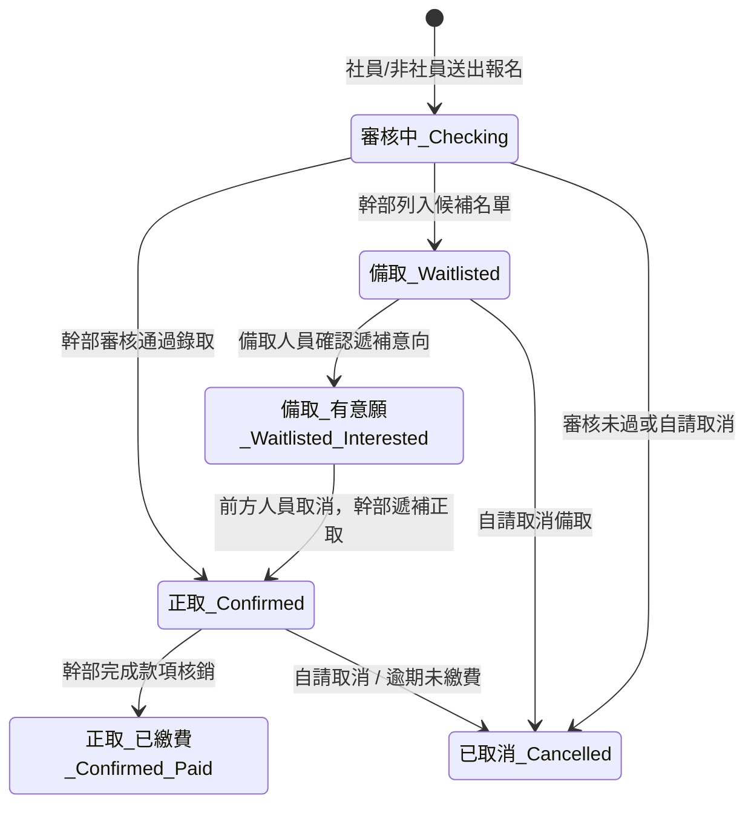
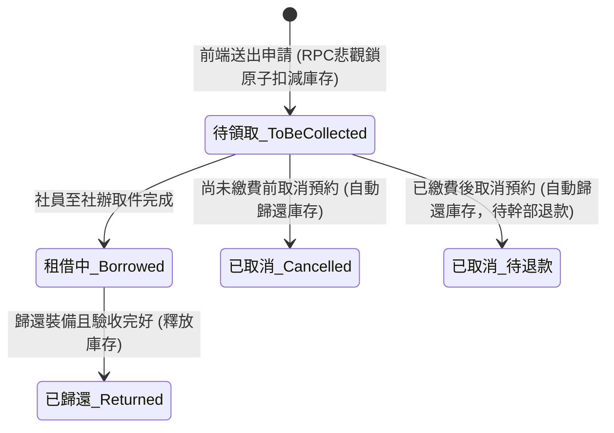

# 社團核心業務邏輯與狀態機指引 (Club Business Workflows)

本指南彙整台科登山社專案四大核心業務模組的真實狀態流轉、業務規則、RPC 呼叫與例外處置機制。本指南所有欄位與列舉值皆百分之百對齊正式資料庫即時驗證之 [supabase/SCHEMA_DICTIONARY.md](file:///Users/brianhung/Documents/OfficialLINEAccount/supabase/SCHEMA_DICTIONARY.md)。

---

## 1. 會員與幹部身分管理 (Members & Officers)

### (1) 關聯資料表結構
- **`members` (29 欄位)**：
  - 主鍵：`line_user_id` (TEXT)
  - 核心欄位：`name`, `student_id`, `department`, `gender`, `phone`, `email`, `birthday`, `id_card`, `is_official_member` (BOOLEAN), `payment_status` (`payment_status_enum`), `emergency_contact_*`, `outdoor_experience`, `fitness_desc`, `proof_urls` (JSONB), `is_officer` (BOOLEAN), `officer_role` (TEXT)。
- **`officers` (9 欄位)**：
  - 主鍵：`line_user_id` (TEXT，一對一關聯 `members.line_user_id`)
  - 核心欄位：`title` (社團職稱如社長、嚮導長、裝備長), `name`, `role` (權限角色如 admin, cadre), `photo_url`, `responsibilities`, `message`。

### (2) 業務規則
- **幹部權限判定**：後台管理介面 (`/admin/*`) 必須校驗登入之 `line_user_id` 是否在 `officers` 中，且 `members.is_officer = true`。
- **資料同名同步**：當幹部在後台修改個人基本資料時，Trigger 會自動同步回 `members`，反之亦然。所有觸發器開頭**必須具備** `IF pg_trigger_depth() > 1 THEN RETURN NEW; END IF;` 防遞迴守衛。

---

## 2. 活動報名與名額審核狀態機 (Events & Signups)

### (1) 報名狀態流轉 (`event_signup_status_enum`)

### (2) 關鍵業務邏輯與真實設計
1. **無自動人數上限 (No Automated `max_participants`)**：
   - 經 Live Schema 驗證，`events` 表**無 `max_participants` 欄位**。
   - 所有報名者預設皆為 `'審核中 Checking'`，由主辦幹部/領隊依據行程難度、體能證明自述與男女配比，在後台手動審核分配為 `'正取 Confirmed'` 或 `'備取 Waitlisted'`。
2. **無活動出席確認狀態 (No `attended` state)**：
   - 報名狀態僅管理至繳費確認與正取鎖定，系統未設置亦不需要出席確認狀態。
3. **取消報名與退款標註 (`cancel_event_signup_rpc`)**：
   - 正取人員若已繳費後取消，系統會將其標記為 `'已取消 Cancelled'`，並在 `event_signups.notes` 標記【已繳費待退款】，由財務幹部線下退款。
   - 推播狀態透過 `notification_status`（預設 `'未發送'`）追蹤通知進度。

---

## 3. 裝備租借與庫存狀態機 (Equipment & Loans)

### (1) 租借訂單狀態流轉 (`loans.status`)

### (2) 原子扣減與庫存保證 (`submit_equipment_loan_rpc`)
- 社員於 [src/pages/Borrow.tsx](file:///Users/brianhung/Documents/OfficialLINEAccount/src/pages/Borrow.tsx) 送出購物車時，呼叫 `submit_equipment_loan_rpc`：
  - 以悲觀鎖 `SELECT ... FROM equipments FOR UPDATE` 鎖定品項並檢查 `available_qty >= qty`。
  - **下單當下立即原子扣減** `available_qty`，防範高併發超賣。
  - 建立主訂單 `loans`（包含快照欄位 `total_fee`, `total_rent`, `total_deposit`, `items`, `is_official_member_snapshot`）。
  - 訂單初始狀態設為 `'待領取 To Be Collected'`。
- 當訂單被取消時，呼叫 `cancel_equipment_loan_rpc`：
  - **自動將裝備數量加回** `equipments.available_qty`。
  - 依付款狀態標示為 `'已取消 Cancelled'` 或 `'已取消 (待退款)'`，並註記 `refund_needed = true` 與 `cancelled_at`。

### (3) 計費與優惠規則
- **基本天數與續租加成**：
  - 基本租金（2天以內）：固定為 `price_2day`。
  - 續租費用（超過2天）：每一額外天數加收 `price_extra_day`。
  - 單品基準租金 = `price_2day + (days - 2) * price_extra_day`。
- **身分優惠**：
  - **社團出隊** (`purpose = '社團出隊'`)：租金 **全免 (0 元)**，付款狀態自動標記為 `'已繳費 Paid'`。
  - **社員個人使用** (`is_official_member = true`)：租金 **5 折優惠** (`ROUND(base_price * 0.5)`)。
  - **非社員**：原價計費。
- **保證金 / 押金 (`total_deposit`)**：
  - 目前預設為 0 元，一般租借不預收押金。

---

## 4. 繳費申報與核銷對帳 (Payments & Auditing)

### (1) 繳費單核銷狀態 (`payments.status`)
- `待確認 Checking`: 社員上傳轉帳水單照片 (`proof_image_url`) 或填寫銀行帳號末 5 碼 (`bank_last5`)。
- `已核銷 Confirmed`: 財務幹部於管理後台或透過 Email 免登入單鍵核銷 (`verify_token`) 完成核銷（系統唯一標準值，舊稱「已確認無誤」已廢除）。
- `退件 Rejected`: 查無帳目或相片模糊，退回並於 `officer_notes` 註明原因。

### (2) 免登入安全單鍵核銷機制 (`verify_token`)
- 申報建立時，PostgreSQL 內建 `md5(...)` 函式隨機生成 32 位元唯一核銷密鑰存入 `payments.verify_token`。
- 系統產生 Web 原生核銷連結至財務幹部 Email：
  `https://equipments-seven.vercel.app/confirm-payment?paymentId={id}&token={verify_token}`
- 幹部於電腦或手機瀏覽器點擊即可直連 Supabase RPC `verify_payment_by_token` 秒級完成核銷，零帳號衝突。

### (3) 關聯資料表款項狀態同步 (`payment_status_enum`)
- 實體表（`members`, `event_signups`, `loans`）之 `payment_status` 欄位列舉值為：
  - `'未繳費 Unpaid'`
  - `'待確認 Checking'`
  - `'已繳費 Paid'`
- 核銷通過時，將關聯的活動報名名冊或裝備租借單同步改為 `'已繳費 Paid'`，並推播 LINE Flex 卡片通知社員。
