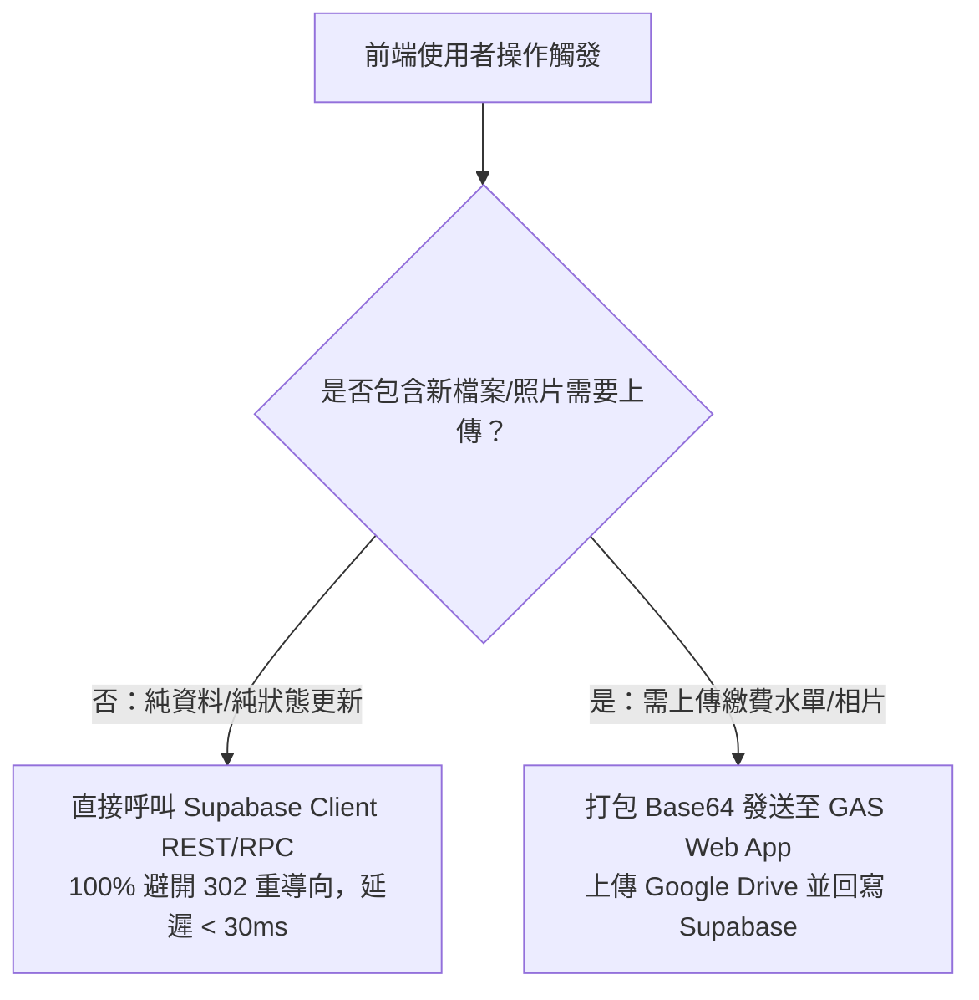

# LIFF 前端與 iOS WebKit 相容性規範 (LIFF & iOS WebKit Guide)

本指南規範基於 React 19、TypeScript、Vite 與 `@line/liff` 的前端開發原則，特別針對 iOS LINE 內建 WebKit 瀏覽器的各項底層相容性問題與解決方案。

---

## 1. 核心網路策略：iOS WebKit 避坑架構



### (1) 為什麼會有 `TypeError: Load failed`？
- iOS 系統中的 LINE 內建瀏覽器採用 WebKit 核心。
- 當發送 POST 請求至 Google Apps Script Web App 時，GAS 伺服器會回應 `302 Found` 重導向至 `script.googleusercontent.com`。
- iOS WebKit 基於跨域安全策略與 Cookie/Header 處理，會直接阻斷此 302 POST 重導向，拋出底層 `TypeError: Load failed`，完全無法取得後續回傳。

### (2) 解決方案：純資料一律走 Supabase 直通
- 凡是不需要 Google Drive 上傳的新增、修改、刪除、排序、報名與審核：
  ```typescript
  // 正確範例：直接寫入 Supabase，絕不呼叫 GAS
  import { supabase } from '../utils/supabaseClient';

  const { data, error } = await supabase
    .from('equipment_items')
    .update({ name: newName, status: newStatus })
    .eq('id', equipmentId);

  if (error) {
    // 嚴格遵守錯誤透明規範：直接顯示具體錯誤
    alert(`更新失敗: ${error.message} (代碼: ${error.code})`);
    return;
  }
  ```

### (3) 檔案上傳之透明例外處理
- 當使用者必須上傳繳費證明、活動花絮照片時：
  - 先在前端檢查檔案格式與容量限制（例如限制 < 5MB）。
  - 將檔案轉為 Base64 字串後發送到後端。
  - 使用 `try ... catch` 完整捕捉錯誤，並將 `err.message` 或 response text 原樣提示給使用者。

---

## 2. LIFF 生命週期與身分驗證流程

### (1) 初始化檢查順序
在前端入口 (`src/App.tsx` 或專屬 Context) 初始化 LIFF：

```typescript
import liff from '@line/liff';

async function initLiff() {
  try {
    await liff.init({ liffId: import.meta.env.VITE_LIFF_ID });
    
    if (!liff.isLoggedIn()) {
      liff.login();
      return;
    }
    
    const profile = await liff.getProfile();
    // 取得 profile.userId, profile.displayName, profile.pictureUrl
    // 同步綁定至 Supabase members 表
  } catch (err: any) {
    console.error('LIFF 初始化失敗:', err);
    alert(`LIFF 初始化失敗: ${err?.message || JSON.stringify(err)}`);
  }
}
```

### (2) 外部瀏覽器 vs LINE 內建環境相容
- 透過 `liff.isInClient()` 判定是否在 LINE App 內。
- 若在外部瀏覽器開啟，應保持 UI 能夠以訪客模式瀏覽公開活動，或引導使用者於 LINE 中開啟以完成身分認證。

---

## 3. UI 與 i18n 多語系規範

1. **Mobile-First 響應式佈局**：
   - 90% 以上的使用者均在手機螢幕上操作 LIFF。按鈕點擊範圍應足夠（至少 44x44px），避免微小元素導致誤觸。
   - 考慮 iOS 底部安全區域 (`safe-area-inset-bottom`)。
2. **多語系 (i18n)**：
   - 專案使用 `react-i18next`，語言設定存放於 `src/locales/`。
   - 介面文案必須同步提供繁體中文 (`zh-TW`) 與英文 (`en`)，切勿在程式碼中寫死未封裝的中文字串。
