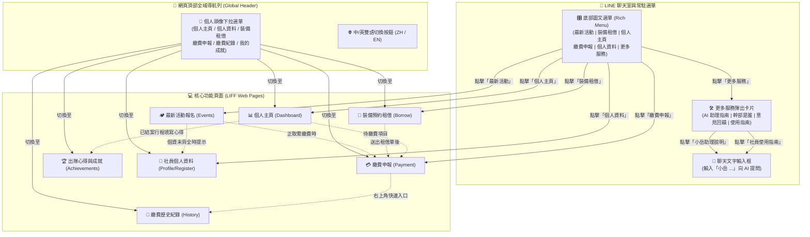
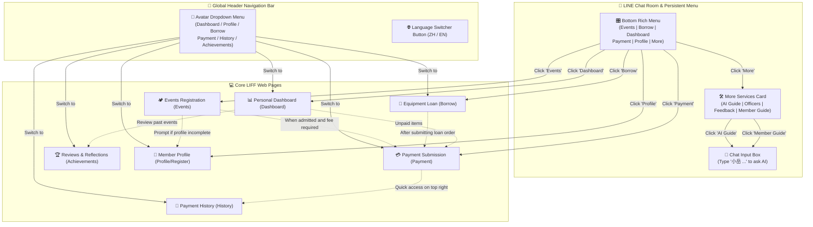

# 🏔️ 國立臺灣科技大學登山社 官方 LINE 帳號社員使用指南
# NTUST Hiking Club Official LINE Account - Member Guide

> 歡迎加入台科登山社大家庭！本指南旨在協助所有社員快速掌握社團 LINE 官方帳號與線上服務系統的完整功能、頁面導航動線與各項業務流程。
>
> Welcome to the NTUST Hiking Club! This guide is designed to help all members quickly master the features, navigation paths, and workflows of our official LINE account and web system.

---

## 📑 目錄 / Table of Contents

- [第一部分：社員使用指南（繁體中文版）](#-第一部分社員使用指南繁體中文版)
  - [1. 系統總覽與介面切換架構圖](#1-系統總覽與介面切換架構圖)
  - [2. 如何切換到不同頁面？（兩大導航途徑）](#2-如何切換到不同頁面兩大導航途徑)
  - [3. 新手起手式：完善社員個人資料](#3-新手起手式完善社員個人資料)
  - [4. 最新活動探索與報名流程](#4-最新活動探索與報名流程)
  - [5. 裝備預約與借還租金規範](#5-裝備預約與借還租金規範)
  - [6. 繳費申報與核銷狀態查詢](#6-繳費申報與核銷狀態查詢)
  - [7. 個人主頁管理與自請取消](#7-個人主頁管理與自請取消)
  - [8. 出隊心得填寫](#8-出隊心得填寫)
  - [9. 智慧 AI 客服「小岳」使用技巧](#9-智慧-ai-客服小岳使用技巧)
  - [10. 常見問題與疑難排解 (FAQ)](#10-常見問題與疑難排解-faq)
- [Part II: Member User Guide (English Version)](#-part-ii-member-user-guide-english-version)
  - [1. System Overview & Navigation Architecture](#1-system-overview--navigation-architecture)
  - [2. How to Switch Between Pages? (2 Navigation Methods)](#2-how-to-switch-between-pages-2-navigation-methods)
  - [3. Getting Started: Complete Member Profile](#3-getting-started-complete-member-profile)
  - [4. Exploring & Signing Up for Events](#4-exploring--signing-up-for-events)
  - [5. Equipment Loan & Rental Regulations](#5-equipment-loan--rental-regulations)
  - [6. Payment Submission & Verification](#6-payment-submission--verification)
  - [7. Personal Dashboard & Voluntary Cancellation](#7-personal-dashboard--voluntary-cancellation)
  - [8. Activity Reflections & Footprints](#8-activity-reflections--footprints)
  - [9. AI Assistant "Xiao Yue" Guide](#9-ai-assistant-xiao-yue-guide)
  - [10. Frequently Asked Questions (FAQ)](#10-frequently-asked-questions-faq)

---

# 第一部分：社員使用指南（繁體中文版）

## 1. 系統總覽與介面切換架構圖

台科登山社官方帳號整合了 **LINE 官方帳號機器人** 與 **LIFF Web App (輕量線上系統)**，提供一站式的登山活動報名、裝備租借、繳費申報、個人主頁及 AI 諮詢服務。

系統各模組之間的互通架構如下圖所示：

---

## 2. 如何切換到不同頁面？（兩大導航途徑）

無論您目前停留在哪個介面，都可以透過以下兩種方式切換到目標頁面：

### 途徑一：LINE 官方帳號底部「圖文選單」(Rich Menu)
在官方帳號聊天室下方，設有 6 格常駐按鈕：
1. **最新活動**：瀏覽目前開放報名與籌備中的登山活動列表。
2. **裝備租借**：瀏覽社團裝備庫存、租金與預約借用。
3. **個人主頁**：查看自己參加的社員資格、活動進度、借用的裝備與待繳費用。
4. **繳費申報**：匯款完成後，在此填寫末五碼與備註。
5. **個人資料**：檢視或修改姓名、學號、手機、緊急聯絡人等基本資料。
6. **更多服務**：展開查看幹部團隊名冊、意見回饋表單、小岳助理說明與本使用指南。

### 途徑二：網頁頂部「個人頭像下拉選單」(Global Header Dropdown)
進入任一線上系統頁面後，頂部右上方會顯示您的 **LINE 大頭貼**：
1. 點擊頭像，即可彈出功能跳轉選單。
2. 點擊清單中的任一項目（個人主頁、個人資料、裝備租借、繳費申報、繳費紀錄、我的成就），即可秒級切換頁面，無需關閉重開！

---

## 3. 新手起手式：完善社員個人資料

為了確保登山活動的安全保障、入山入園證申請及裝備借用權益，所有社員於首次使用系統時，**必須先至「個人資料」頁面完成基本資料建檔**。

### 6 大必填項目
1. **真實姓名 (Full Name)**：申請活動入山/入園證及投保登山綜合保險必備。
2. **就讀系所 (Department)**：核對校內社團名冊與學校課外活動組備查。
3. **學生證號/學號 (Student ID)**：區分在學社員與校外山友身分。
4. **連絡電話 (Phone)**：出隊當日突發狀況或集合聯繫使用。
5. **電子郵件 (Email)**：寄送重要行前通知、繳費核銷通知及重大變更公告。
6. **LINE ID**：方便幹部建立活動專屬群組與聯絡使用。

> 🔒 **個人資料安全保護**：本社嚴格遵循個人資料保護原則，您的所有個人敏感資訊僅限於社團出隊保險、留守通報及校方報備使用，資料庫受列級存取控制 (RLS) 保護，絕不外流。

---

## 4. 最新活動探索與報名流程

社團每學期皆會規劃多條郊山、中級山、高山百岳行程。

### 報名四步驟
1. **瀏覽活動**：至「最新活動」頁面瀏覽路線介紹、預定日期與預估費用。
2. **送出登記**：確認個人體能後，點擊「我要報名」。系統具備防連點保護，一人限報名一次，避免重複佔位。
3. **審核與錄取**：領隊與幹部將依照是否為社員、經驗以及體能狀況進行審核。
4. **錄取通知與繳費**：錄取名單公佈後，LINE Bot 會主動發送推播通知。

### 報名狀態一覽表
| 狀態名稱 | 狀態代表意義 | 下一步指引 |
| :--- | :--- | :--- |
| **審核中 Checking** | 報名已成功送出，領隊正在審核資格。 | 請耐心等候名單公佈與推播通知。 |
| **正取 Confirmed** | 恭喜！您已成功錄取為正式隊員。 | 請於規定期限內完成轉帳，並至「繳費申報」頁面回報。 |
| **備取 Waitlisted** | 目前為候補名單，排序依照登記順序與資格排列。 | 若有正取隊員自請取消，幹部將主動通知您。 |
| **正取（已繳費）Confirmed (Paid)** | 幹部已核對您的款項無誤，完成最終錄取！ | 幹部會開活動 LINE 群組，請準時出席行前說明。 |
| **已取消 Cancelled** | 您已主動自請取消報名 | 若欲重新報名，請視活動開放狀態重新操作。|

---

## 5. 裝備預約與借還租金規範

本社備有帳篷、睡袋、睡墊、登山大背包、高山瓦斯爐頭等多種公用裝備供社員借用。

### 租金與押金規範
- **社員專屬半價特惠**：只要具備當學期有效社員身分，系統在結帳時會**自動享有租金 5 折優惠**！
- **借還流程**：
  1. 線上預約：至「裝備租借」勾選裝備品項、選擇出隊借用日期與預計歸還日期，送出申請單。
  2. 領取裝備：將有幹部與你聯繫，確定領取時間以及地點。
  3. 出隊清潔：使用完畢後請徹底陰乾、清除泥沙髒污。
  4. 驗收歸還：歸還至社辦，由幹部檢驗無誤後於系統完成歸還結案。

### 租借狀態說明
- **待領取 To Be Collected**：租借申請已送出，幹部將與您聯繫確定取裝時間與地點。
- **使用中 In Use**：裝備已由幹部點交並領取完畢，出隊使用中。
- **已歸還 Returned**：裝備已歸還至社辦且由幹部驗收完畢，完成結案。
- **已取消 Cancelled**：租借申請已取消（若已繳款將由幹部依退款流程處理）。

---

## 6. 繳費申報與核銷狀態查詢

為簡化多筆帳款對帳負擔，系統支援「多項目合併申報」功能。

### 申報操作指引
1. **匯款轉帳**：將應繳款項匯入社團指定郵局/銀行帳戶（帳號資訊顯示於繳費頁面頂端）。
2. **勾選項目**：進入「💳 繳費申報」頁面，系統會自動列出您名下所有未結清項目（活動報名費、裝備租借費、學期社費）。您可以同時勾選多筆款項進行一次性申報！
3. **填寫末五碼**：輸入您匯款帳戶的**後五碼數字**，有相關備註也可以填寫。
4. **確認金額與送出**：確認系統自動試算的應繳總額與實際匯款金額一致後點擊送出（對於金額有問題可以直接在 LINE 上詢問）。
5. **收到即時推播**：送出後 LINE Bot 會立即推播「繳費申報已成功送出」明細給您留存。
6. **幹部確認繳費**：幹部確認繳費成功後，LINE Bot 會傳送通知，告知繳費成功。

### 核銷狀態辨識
- **待核銷 Checking**：申報資料已送達，財務幹部正在核對銀行金流與存摺入帳。
- **已核銷 Confirmed**：財務幹部已確認款項入帳無誤！您的活動報名狀態或裝備狀態將同步更新為已繳費。
- **查詢歷史紀錄**：至「個人主頁 ➔ 繳費紀錄」或在繳費頁面右上角點擊「歷史紀錄」，隨時查看所有歷史繳款單號、金額與歷年總花費。

---

## 7. 個人主頁管理與自請取消

「個人主頁 (Dashboard)」是每位社員的專屬登山控制台。

### 主頁核心功能
1. **個人狀態卡片**：顯示您的 LINE 暱稱、學號、社員資格有效日期。
2. **活動報名狀態**：列出目前所有的活動日程、目前審核狀態與繳費情形。
3. **裝備租借狀態**：列出目前借用中的裝備清單、應歸還日期、歸還狀態與繳費情形。
4. **自請取消機制 (Voluntary Cancellation)**：
   - 若您因個人突發因素無法出隊，可於活動名單旁的選單點擊「取消」。
   - 請務必遵守社團取消退費規範，出隊前若已有不可退回的項目，如：山屋預約，將扣除後再退款。

---

## 8. 出隊心得填寫

登山不僅是攻頂，更是與夥伴共同奮鬥的美好記憶！

### 出隊心得評分
每當活動圓滿結束且結案後，您可以在「出隊足跡」頁面中，點擊「填寫心得」：
- 提供本次行程的心得，讓社團幹部可以回報給學校。
- 亦可針對路線難度與風景美麗程度進行星級評分、上傳登頂或精彩照片紀錄。

---

## 9. 智慧 AI 客服「小岳 (Yue)」使用技巧

「小岳（英文名：Yue）」是登山社專屬的智慧客服助手，具備社團規章、登山裝備知識及活動資訊應答能力。

### 使用情境與方法
1. **1 對 1 官方帳號私聊**：
   - **必須在訊息中以「小岳」或「Yue」開頭**，AI 才會答覆！例如：「小岳 玉山有多高？」、「Yue 登山睡袋要怎麼挑選？」、「Yue 新手百岳推薦哪座？」
   - **若訊息未包含「小岳」或「Yue」（例如僅輸入「玉山有多高」或一般行政詢問），系統將不會進行 AI 回覆**，訊息會完整保留給真人幹部查看並親自解答，避免 AI 回答需要幹部處理的社團行政或個案問題。
2. **LINE 群組中使用**：
   - 在活動群組中，同樣請在訊息中「@小岳」或「@Yue」，或以「小岳」/「Yue」開頭（例如：`@Yue 請問這週末集合時間？`），小岳才會為大家解答。

---

## 10. 常見問題與疑難排解 (FAQ)

### Q1：使用 iPhone (iOS) 開啟畫面出現「Load failed」或白畫面怎麼辦？
**A**：此為 iOS 系統內建 WebKit 瀏覽器暫存限制。
- 請先完全將 LINE App 由背景滑掉重開。
- 若仍無法改善，麻煩回報幹部（可點選「更多服務」回報或直接在 LINE 上說明）

### Q2：為什麼點擊「裝備租借」或「繳費申報」會跳出「個人資料不完整」彈窗？
**A**：因為租借公物與繳費核銷需要確切的學生證號與聯絡資訊。請點擊彈窗上的「前往填寫資料」按鈕，將 6 個必填欄位補齊後，系統便會立即解除阻擋。

### Q3：匯款完成並申報後，要多久才會看到狀態變成「已核銷 Confirmed」？
**A**：財務幹部收到訊息後會立刻核對。查核核對無誤後，系統會立即變更狀態為 `已核銷 Confirmed` 並透過 LINE 發送成功通知。若超過 1 天未通知或更新狀態，請直接在本帳號詢問。

### Q4：如果臨時有事無法參加已錄取的活動，可以直接找朋友代去嗎？
**A**：**嚴禁私下換人！** 由於高山國家公園入山/入園證及保險皆為實名制登記，私自換人將面臨國家公園法罰鍰並喪失保險保障。請務必至個人主頁點擊「取消」，幹部將會處理遞補。

---
---

# Part II: Member User Guide (English Version)

## 1. System Overview & Navigation Architecture

The NTUST Hiking Club Official Account integrates the **LINE Official Bot** with a **LIFF Web Application**, providing a seamless all-in-one platform for event registration, gear rental, payment submission, personal dashboards, and AI climbing assistance.

The relationship between system modules is illustrated below:

---

## 2. How to Switch Between Pages? (2 Navigation Methods)

No matter which page you are currently viewing, you can navigate using either of the two convenient methods:

### Method 1: The LINE Rich Menu (Bottom of Chat)
At the bottom of the official account chat room, 6 quick buttons are always available:
1. **🏕️ Latest Events**: Browse current and upcoming hiking events.
2. **🎒 Equipment Loan**: View gear inventory, rental rates, and book club gear.
3. **📊 Personal Dashboard**: Check your member qualification, activity statuses, active gear loans, and pending balances.
4. **💳 Payment Submission**: Report your transfer's last 5 digits and remarks after payment.
5. **📝 Member Profile**: View or edit your full name, student ID, phone number, emergency contact details, etc.
6. **🛠️ More Services**: Access the club officer directory, feedback form, AI guide, and this user manual.

### Method 2: Global Header Avatar Dropdown (Inside Web App)
When viewing any system page, your **LINE Avatar** is displayed at the top right:
1. Tap your avatar to open the navigation dropdown menu.
2. Select any target page (Dashboard, Profile, Borrow, Payment, History, Achievements) to switch instantly in seconds without closing the window!

---

## 3. Getting Started: Complete Member Profile

To ensure mountain safety, permit approvals from national park authorities, and insurance coverage, all members **must complete their profile before signing up for events or renting equipment**.

### 6 Mandatory Fields
1. **Full Name**: Required for national park entry permits and mountaineering insurance.
2. **Department**: For NTUST student club roster verification and school reporting.
3. **Student ID**: Distinguishes current NTUST students from alumni and non-student members.
4. **Phone Number**: For urgent communications during trip assembly or emergencies.
5. **Email Address**: For trip itineraries, payment confirmations, and critical notices.
6. **LINE ID**: Enables trip leaders to add you to dedicated trip groups and communicate.

> 🔒 **Privacy Guarantee**: All personal data is securely protected under strict Row-Level Security (RLS) policies and used exclusively for permits, insurance, and club verification.

---

## 4. Exploring & Signing Up for Events

The club organizes various outings each semester, including day hikes, wilderness exploration, High Peaks (Baiyue), and technical mountaineering.

### 4-Step Registration Process
1. **Browse Events**: Check itinerary details, dates, and estimated costs on the "Latest Events" page.
2. **Submit Application**: Ensure your fitness matches the route, then tap "Register". Multi-click prevention is enabled, limiting one submission per person.
3. **Qualification Review**: Leaders review applications based on member status, experience, and fitness.
4. **Notification & Payment**: Once approved, LINE Bot will automatically send you an acceptance push notification.

### Application Status Definitions
| Status Label | Meaning | Action Required |
| :--- | :--- | :--- |
| **審核中 Checking** | Registration received; under review by trip leaders. | Please wait for announcements and push notifications. |
| **正取 Confirmed** | Congratulations! You have been accepted. | Please transfer the event fee within the deadline and submit payment proof. |
| **備取 Waitlisted** | Currently on the waiting list. | If an accepted member cancels, leaders will notify you. |
| **正取（已繳費）Confirmed (Paid)** | Payment has been verified by the finance officer! | Officers will open the event LINE group; please attend the pre-trip meeting on time. |
| **已取消 Cancelled** | You have voluntarily cancelled your registration. | You may re-apply if open spots become available. |

---

## 5. Equipment Loan & Rental Regulations

The club maintains shared gear including tents, sleeping bags, sleeping pads, backpacks, stoves, and technical equipment.

### Rental Rates & Deposits
- **50% Discount for Active Members**: As long as you are a registered club member for the semester, a **50% discount on rental fees** is automatically applied at checkout!
- **Loan Workflow**:
  1. Book Online: Select items, pickup dates, and return dates on the "Equipment Loan" page, then submit the request.
  2. Pick Up: An officer will contact you to arrange the pickup time and location.
  3. Clean After Use: Thoroughly clean and air-dry all equipment after your trip.
  4. Inspection & Return: Return items to the club room for inspection and settlement by officers.

### Loan Status Definitions
- **待領取 To Be Collected**: Request submitted; an officer will contact you to arrange pickup time and location.
- **使用中 In Use**: Equipment has been inspected and picked up; currently in use for the trip.
- **已歸還 Returned**: Equipment has been returned to the club room, inspected by officers, and settled.
- **已取消 Cancelled**: Loan request cancelled (refunds handled by officers if applicable).

---

## 6. Payment Submission & Verification

To simplify transactions, our system supports "Multi-Item Bundled Reporting".

### Step-by-Step Payment Reporting
1. **Bank Transfer**: Transfer the total amount to the designated club bank/post office account (account details are displayed at the top of the Payment page).
2. **Select Unpaid Items**: On the "💳 Payment" page, select all items you are paying for simultaneously (event fees, gear rentals, club membership dues).
3. **Input Last 5 Digits**: Enter the **last 5 digits of your bank account** and any relevant remarks.
4. **Submit & Confirm**: Verify the calculated total matches your transferred amount, then tap Submit (if you have questions regarding the amount, feel free to ask directly in LINE).
5. **Instant LINE Push**: You will receive an immediate LINE notification confirming receipt of your payment report.
6. **Officer Confirmation**: Once verified by finance officers, LINE Bot sends a confirmation notice.

### Payment Status Labels
- **待核銷 Checking**: Report received; finance officer is reconciling bank statements.
- **已核銷 Confirmed**: Payment successfully reconciled! Event and gear statuses update to Paid.
- **Payment History**: Tap "📜 History" on the Payment page or Dashboard to view past transaction records and lifetime spending.

---

## 7. Personal Dashboard & Voluntary Cancellation

The "Dashboard" is your personalized mountaineering mission control.

### Core Features
1. **Profile Summary**: Displays your LINE nickname, student ID, and member semester status.
2. **My Events**: Displays all your registered trip dates, review statuses, and payment statuses.
3. **My Gear Loans**: Tracks currently borrowed items, return dates, return statuses, and payment statuses.
4. **Voluntary Cancellation**:
   - If you cannot attend an event due to personal circumstances, click "Cancel" next to the event in your Dashboard.
   - Please review club refund policies; non-refundable costs already incurred (such as cabin permits) will be deducted before refunding.

---

## 8. Activity Reflections & Footprints

Mountaineering is about shared memories and growth with teammates!

### Post-Trip Reviews & Reflections
After a trip concludes and is settled, visit the "Footprints" page and tap "Write Review":
- Provide trip reflections for club officers to report to the university.
- Rate trail difficulty and scenery, and upload summit or highlight photos.

---

## 9. AI Assistant "Xiao Yue" (Yue) Guide

"Xiao Yue" (English name: Yue) is the club's dedicated smart AI climbing assistant, equipped with club knowledge, gear advice, and event information.

### How to Use
1. **1-on-1 Direct Chat**:
   - **You MUST start your message with "小岳" or "Yue" to trigger the AI!**
     *Examples*: "小岳 How high is Yushan?", "Yue How do I choose a sleeping bag for high altitude?", "Yue Which Baiyue peak is recommended for beginners?"
   - **If a message does NOT contain "小岳" or "Yue" (e.g. only typing "How high is Yushan?" or general chat), the AI will NOT reply.** The message will be left quietly in chat for human officers to read and answer directly, preventing the AI from erroneously answering questions that require officer intervention.
2. **Tag in LINE Groups**:
   - In hiking groups, type `@小岳` or `@Yue`, or start with "小岳" or "Yue" followed by your question (e.g. `@Yue What time do we assemble for the upcoming hike?`) to get an answer.

---

## 10. Frequently Asked Questions (FAQ)

### Q1: What should I do if iOS displays "Load failed" or a blank page?
**A**: This is caused by iOS WebKit cache limitations.
- Swipe up to completely force-quit the LINE App and reopen it.
- If the issue persists, please report to officers (tap "More Services ➔ Feedback" or leave a message directly in LINE chat).

### Q2: Why does the system block me with a "Profile Incomplete" popup?
**A**: Real name and contact information are required for outdoor safety, insurance, and equipment deposits. Tap "Go to Profile", fill in the 6 mandatory fields, and access will be unlocked instantly.

### Q3: How long does it take for payments to change to "已核銷 Confirmed"?
**A**: Finance officers reconcile bank deposits promptly upon notification. Once reconciled, the status changes to `已核銷 Confirmed` and a LINE push is delivered. If your status has not updated after 1 day, please ask directly in this chat.

### Q4: Can a friend take my spot if I can no longer attend an event?
**A**: **Private substitutions are strictly prohibited!** National park permits and insurance policies are non-transferable legal documents under real-name verification. Violations may result in park fines and loss of insurance coverage. Please use the "Cancel" button on your Dashboard so waitlisted members can be promoted legally.

---

*台科登山社 敬上 / NTUST Hiking Club*
