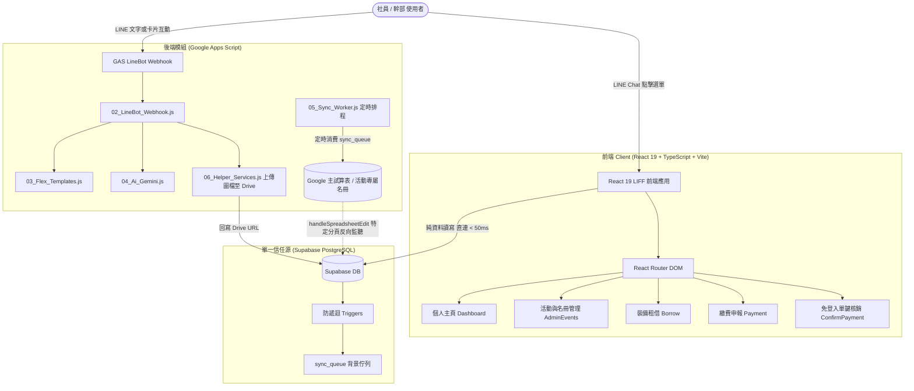

# 🏔️ 國立臺灣科技大學登山社 - 社團官方數位系統 (NTUST Hiking Club Official System)

[](package.json)
[](https://react.dev/)
[](https://www.typescriptlang.org/)
[](https://vitejs.dev/)
[](https://supabase.com/)
[](https://developers.line.biz/en/docs/liff/)

本系統為**國立臺灣科技大學登山社**打造之現代化官方 LINE 數位生態系，整合 **LINE Front-end Framework (LIFF)**、**Supabase PostgreSQL (單一信任源)** 與 **Google Apps Script (GAS 模組化後端)**，提供社員活動報名、裝備租借、繳費申報、心得登頂紀錄與幹部即時審核自動化。

> 📜 **歷史文件封存**：前版龐大日誌與過往除錯歷史（v0.1.0 ~ v0.1.123，逾 3,000 行紀錄）已完整歸檔至 [README_ARCHIVE.md](file:///Users/brianhung/Documents/OfficialLINEAccount/README_ARCHIVE.md)。

---

## 📑 目錄 (Table of Contents)
- [1. 系統架構總覽 (Architecture Overview)](#1-系統架構總覽-architecture-overview)
- [2. 專案目錄結構 (Project Structure)](#2-專案目錄結構-project-structure)
- [3. Supabase 資料庫與信任源規範 (Database & Single Source of Truth)](#3-supabase-資料庫與信任源規範-database--single-source-of-truth)
- [4. 資料修改途徑與試算表同步機制 (Data Modification & Sheet Sync)](#4-資料修改途徑與試算表同步機制-data-modification--sheet-sync)
- [5. 開發與交付規範 (Development Guidelines & Agent Rules)](#5-開發與交付規範-development-guidelines--agent-rules)
- [6. 本地開發與部署流程 (Quick Start & Deployment)](#6-本地開發與部署流程-quick-start--deployment)
- [7. 最新版本異動紀錄 (Changelog v0.1.124)](#7-最新版本異動紀錄-changelog-v01124)

---

## 1. 系統架構總覽 (Architecture Overview)



---

## 2. 專案目錄結構 (Project Structure)

```text
OfficialLINEAccount/
├── src/                          # 前端原始碼 (React 19 + TypeScript)
│   ├── components/               # 共用 UI 元件 (AdminEventCard, AdminEventForm, etc.)
│   ├── pages/                    # 主要業務頁面 (Dashboard, AdminEvents, Borrow, Payment...)
│   ├── utils/                    # 工具函式 (supabaseClient.ts, directImage.ts, cache.ts...)
│   ├── i18n/                     # 多語系配置 (zh-TW, en)
│   └── gas.js                    # GAS 整合全模組單檔備援 Bundle
├── gas_modules/                  # GAS 模組化後端 (職責分離)
│   ├── 01_Config_Auth.js         # 全域設定、環境變數、JWT 驗證與全域中英表頭對照
│   ├── 02_LineBot_Webhook.js     # doPost Webhook 入口、文字/圖片事件路由、Email Webhook
│   ├── 03_Flex_Templates.js      # LINE Flex Message (活動卡片輪播、詳情、借用清冊)
│   ├── 04_Ai_Gemini.js           # Gemini AI 登山知識問答與裝備推薦
│   ├── 05_Sync_Worker.js         # Supabase sync_queue 排程消費、試算表同步與每日自動巡檢
│   └── 06_Helper_Services.js     # Google Drive 檔案上傳、身分驗證、郵件發送與通知
├── supabase/                     # Supabase 資料庫定義與 RPC Migration 腳本
│   ├── schema.sql                # 核心 Schema、ENUM 定義與索引
│   ├── triggers.sql              # 背景佇列寫入觸發器 (含防遞迴守衛)
│   ├── admin_events_rpc.sql      # 活動管理、截止日解析 (+08) 與報名名冊 RPC
│   ├── member_profile_rpc.sql    # 社員個資儲存與幹部身分防護 RPC
│   └── SCHEMA_DICTIONARY.md      # 資料庫欄位字典與資料型別規範
├── test/                         # Node.js 內建輕量化單元測試集 (155+ Tests)
├── README.md                     # 本專案核心導覽 (本文件)
├── README_ARCHIVE.md             # 歷史詳細改版紀錄封存
├── MEMBER_GUIDE.md               # 社員使用指南 (LINE 內嵌文檔)
└── AGENTS.md                     # AI Agent 開發守則與專案憲章
```

---

## 3. Supabase 資料庫與信任源規範 (Database & Single Source of Truth)

1. **單一信任源原則 (Single Source of Truth)**：
   - 專案所有核心商業狀態（社員狀態、活動名冊、租借庫存、繳費狀態）以 **Supabase PostgreSQL** 為唯一信任源。
   - Google Sheets 僅作為幹部試算表檢視輔助與離線備忘，嚴禁將 Google Sheets 當作業務判斷的真理來源。
2. **防遞迴守衛 (Recursion Guards)**：
   - 所有 PostgreSQL 觸發器與連動函式開頭必須強制具備防遞迴守衛：
     ```sql
     IF pg_trigger_depth() > 1 THEN
         RETURN NEW;
     END IF;
     ```
3. **時區標準 (Asia/Taipei UTC+8)**：
   - 活動截止時間 (`events.deadline`) 儲存時一律標記為台灣時區（如 `YYYY-MM-DD 23:59:59+08`）。
   - 查詢與格式化時一律使用 `AT TIME ZONE 'Asia/Taipei'`，防止跨日多算一天（例如 9/22 23:59 被誤轉為 9/23）。
4. **純資料走 Supabase 直通**：
   - 無 Google Drive 實體圖檔上傳之純欄位更新，前端直接走 Supabase REST Client / RPC，杜絕 iOS LINE WebKit 對 GAS 302 跨域重導向之 `Load failed` 報錯。

---

## 4. 資料修改途徑與試算表同步機制 (Data Modification & Sheet Sync)

### (1) 修改 Supabase 的四大途徑

| 途徑 | 適用情境 | 即時性與可靠度 | 試算表連動方式 |
| :--- | :--- | :--- | :--- |
| **途徑一：LIFF 幹部前台網頁** *(首選)* | 活動建立與編輯、報名名冊審核、裝備歸還、核銷操作。 | **極速 (<50ms)**，具前端資料校驗與防併發保護。 | Supabase 觸發器寫入 `sync_queue`，定時同步至主試算表。 |
| **途徑二：Supabase 官方 Dashboard** | 資料庫維護、歷史資料清洗、批次 SQL 修正。 | **即時生效**。 | 自動觸發 `sync_queue` 排程同步至主試算表。 |
| **途徑三：主試算表直接編輯** | 幹部偏好試算表批次對帳、名冊直接填寫審核結果。 | **即時生效**（需安裝 Trigger，僅限特定欄位）。 | 透過 `handleSpreadsheetEdit` 即時 PATCH 回寫 Supabase。 |
| **途徑四：LINE Bot 群組推播 / Email 核銷** | 幹部於群組點擊審核按鈕、於通知信點擊「確認無誤」。 | **即時生效** (GAS 呼叫 Supabase API)。 | 自動更新 Supabase，再排程同步至試算表。 |

### (2) 試算表即時反向同步範圍與限制
若幹部直接在主試算表儲存格中編輯，系統透過 `handleSpreadsheetEdit`（需在試算表選單點選「🏔️ 社團系統」>「⚙️ 安裝試算表即時編輯觸發器」）反向更新 Supabase：

- ✅ **支援即時反向同步的分頁與欄位**：
  - **Payments (繳費分頁)**：修改狀態為「已確認無誤」或「已核銷 Confirmed」，會觸發核銷程序並回寫 Supabase。
  - **Loans (租借分頁)**：修改狀態為「已歸還 Returned」，會更新 Supabase 並自動回補裝備庫存。
  - **Event_Signups (報名名冊) / 各活動專屬名冊**：修改「審核結果」、「狀態」、「繳費狀態」、「備註」，會即時反向 PATCH 回 Supabase。
- ❌ **尚未支援試算表反向同步的分頁**：
  - `members`（社員個資、幹部職稱）、`events`（活動資訊、費用、日期）、`equipments`（器材品項與規格）目前未設置試算表反向同步。
  - **請勿在試算表中直接修改這些分頁**，請統一由 LIFF 後台或 Supabase Dashboard 修改，否則下一次執行全量同步時試算表的手動修改將被覆蓋。

### (3) Supabase 新增欄位與試算表自適應
- **背景佇列同步 (`_ensureColumnsExist`)**：當 Supabase 異動時，若試算表缺少該欄位，系統會自動在第 1 列最右側追加新欄位。
- **全量覆蓋更新 (`overwriteMainSpreadsheetFromSupabase`)**：幹部可隨時於試算表點選「🏔️ 社團系統」>「🔄 全量從 Supabase 覆蓋更新主試算表」，系統將向 Supabase OpenAPI 自動動態探索所有資料表與新欄位，一鍵完整同步。

---

## 5. 開發與交付規範 (Development Guidelines & Agent Rules)

根據 [AGENTS.md](file:///Users/brianhung/Documents/OfficialLINEAccount/AGENTS.md) 與專案核心規範：

1. **錯誤訊息一律直接印出**：
   - 無論前端 UI、後端 API 或資料庫 RPC，發生錯誤時必須直接顯示完整具體的錯誤原因（如 `error.message`、PostgreSQL 錯誤代碼），嚴禁遮蔽或包裝為空泛的「請聯絡管理員」。
2. **檔案變更需經使用者同意**：
   - 在修改現有程式碼檔案前，必須先提出具體的 Implementation Plan 並徵得使用者同意後方可執行。
3. **版本號自動遞增**：
   - 每次修改程式碼或架構後，必須在 `package.json` 與相關說明中遞增版本號 tag（如 `v0.1.124`）。
4. **依賴套件管理**：
   - 專案統一使用 `pnpm` 管理套件，嚴禁使用 npm 或 yarn。
5. **文件持續維護**：
   - 每次程式碼變更後，必須以繁體中文更新 `README.md`。

---

## 6. 本地開發與部署流程 (Quick Start & Deployment)

### 環境需求
- Node.js >= 20.x
- pnpm >= 9.x

### 指令清單
```bash
# 安裝相依套件
pnpm install

# 啟動本地 Vite 開發伺服器
pnpm dev

# 執行 TypeScript 型別檢查與生產打包建置
pnpm build

# 執行全套單元測試 (含時區、同步、鑑權等 155+ 測試)
pnpm test
```

### GAS 後端部署
1. 開啟專案對應之 Google Apps Script 專案。
2. 將 `gas_modules/` 下各模組（或打包後的 `src/gas.js`）內容貼入對應之 GAS 指令碼檔案中。
3. 確保 Script Properties 配置必要變數：`SUPABASE_URL`, `SUPABASE_SERVICE_ROLE_KEY`, `SPREADSHEET_ID`, `MEMBER_BOT_TOKEN`, `ADMIN_BOT_TOKEN`。
4. 部署為 Web 應用程式 (Execute as: Me, Who has access: Anyone)。

---

## 7. 最新版本異動紀錄 (Changelog v0.1.127)

### v0.1.127 (2026-09-16)
- 🛠️ **Supabase `admin_events_rpc.sql` 參數名稱一致性與防禦修復 ([supabase/admin_events_rpc.sql](file:///Users/brianhung/Documents/OfficialLINEAccount/supabase/admin_events_rpc.sql))**：
  - **解決 PostgreSQL 42P13 參數重命名錯誤**：修復 `sync_officer_cache_rpc` 函式第一個參數名稱為 `p_officer_line_user_id`，確保與現有資料庫結構及前端呼叫端 (`src/utils/supabaseClient.ts`) 完全對齊。
  - **加入防禦性 DROP FUNCTION**：於函式建立前加上 `DROP FUNCTION IF EXISTS sync_officer_cache_rpc(TEXT, TEXT, TEXT);`，徹底避免資料庫更新時發生簽名與參數衝突，提供 100% 冪等性與安全執行體驗。

### v0.1.126 (2026-09-16)
- 🏔️ **對外客服「小岳 (Yue)」與幹部管理「小岳助理」嚴格隔離解耦 ([gas_modules/02_LineBot_Webhook.js](file:///Users/brianhung/Documents/OfficialLINEAccount/gas_modules/02_LineBot_Webhook.js), [src/gas.js](file:///Users/brianhung/Documents/OfficialLINEAccount/src/gas.js))**：
  - **英文名字「Yue」正式支援**：對外 AI 客服完整支援英文名「Yue」（大小寫不拘、詞邊界精準匹配，如 `Yue 玉山有多高`、`yue, how high is Yushan?`、`@Yue 裝備怎麼借`），杜絕單字（如 rescue, continue）誤觸發。
  - **前綴標點自動清理**：自動清除「小岳」、「Yue」、「@Yue」及接續的逗號、冒號等標點符號，將乾淨問題交付 Gemini API。
  - **雙語友善引導**：社員若單獨輸入 `Yue`、`@Yue` 或 `小岳`，自動回傳繁中與英文雙語提問範例與操作指引。
  - **「小岳助理」幹部專用與完全靜默守衛**：
    - 「小岳助理」嚴格僅於已綁定之幹部管理群組內響應（或於群組執行綁定指令）。
    - 於 1 對 1 私聊或一般非幹部群組中若呼叫「小岳助理」，系統採**完全靜默模式**，不予回應、不調用對外 AI、亦不假冒幹部小幫手，徹底杜絕權限混淆。
    - 於登山出隊活動群組中，社員可透過 `@小岳` 或 `@Yue` 呼叫對外 Bot 進行活動與山岳諮詢。
- 📖 **社員使用指南 ([MEMBER_GUIDE.md](file:///Users/brianhung/Documents/OfficialLINEAccount/MEMBER_GUIDE.md)) 中英文同步更新**：
  - 第 9 節「智慧 AI 客服」中英文版同步載明社員可使用中文名「小岳」或英文名「Yue」進行 1 對 1 或群組諮詢。
- 🧪 **單元測試全數覆蓋**：
  - 更新 [test/60_ai_mention_and_chat_keyword_cleanup.test.mjs](file:///Users/brianhung/Documents/OfficialLINEAccount/test/60_ai_mention_and_chat_keyword_cleanup.test.mjs)，驗證「Yue」觸發、邊界過濾、標點清除、小岳助理私聊/非幹部群組靜默及幹部群組響應，159 項單元測試全數 Pass，前端 build 順利。

### v0.1.125 (2026-09-16)
- 🤖 **小岳 AI 客服顯式觸發機制健全化 ([gas_modules/02_LineBot_Webhook.js](file:///Users/brianhung/Documents/OfficialLINEAccount/gas_modules/02_LineBot_Webhook.js), [src/gas.js](file:///Users/brianhung/Documents/OfficialLINEAccount/src/gas.js))**：
  - **強制「小岳」開頭/包含觸發**：修改 1 對 1 私聊與群組文字事件處理邏輯，只有訊息中包含「小岳」（如：「小岳 玉山有多高」、「@小岳 裝備怎麼借」）時，才會啟動 Gemini AI 進行知識庫應答，並自動去除「小岳」前綴將乾淨問題送給模型。
  - **杜絕普通訊息攔截**：若訊息未包含「小岳」（例如純輸入「玉山有多高」或向社團詢問行政庶務），系統一律保持靜默，不啟動 AI 亦不發送招呼語洗版，訊息完整保留於 LINE 官方後台供真人幹部查看並親切回覆。
  - **單純叫名引導**：若僅輸入「小岳」或「@小岳」，自動回傳友善提問範例引導，而非丟空字串給模型。
- 🧹 **聊天室純文字指令與過時關鍵字全面清理**：
  - 徹底移除過往文字指令攔截（「最新活動」、「Activities」、「嗨」、「哈囉」、「選單」等），避免普通對話遭無效機器人字串打斷。
  - 保留圖文選單按鈕必要之「更多服務 More Services」、次級選單按鈕（「使用指南」、「幹部是誰」、「意見與回饋」）及幹部核銷指令（「核銷 PAY_xxx」）。
- 📖 **社員使用手冊 ([MEMBER_GUIDE.md](file:///Users/brianhung/Documents/OfficialLINEAccount/MEMBER_GUIDE.md)) 中英文版同步對齊更新**：
  - **導航途徑更新**：由舊有的「四大途徑」精簡為「兩大導航途徑」（LINE 官方底部圖文選單、系統頂部個人頭像下拉選單），全篇移除「途徑四：聊天室輸入文字指令」。
  - **裝備租借狀態同步**：依據資料庫與個人主頁實際邏輯，更新為「待領取 To Be Collected」、「使用中 In Use」、「已歸還 Returned」、「已取消 Cancelled」，並載明幹部聯繫取裝與社辦點交流程。
  - **移除不存在之個人成就勳章牆**：刪除「個人成就勳章牆 (Badges)」段落，將該章節聚焦於「出隊心得填寫 (Footprints & Reflections)」與活動評分、照片上傳。
  - **小岳 AI 調用說明更新**：明確標註私聊提問必須以「小岳」開頭方會答覆，一般提問將由幹部回覆。
  - **中英文 Part I / Part II 100% 鏡像對齊**：同步修正英文版對應章節、狀態清單、導航方式與 FAQ。
- 🧪 **單元測試擴充**：
  - 新增 `test/60_ai_mention_and_chat_keyword_cleanup.test.mjs`，測試全數 158 項通過，前端打包建置無錯誤。

### v0.1.124 (2026-09-16)
- 🕒 **活動截止時間時區偏移與跨日 Bug 徹底修復**：
  - 修正 [admin_events_rpc.sql](file:///Users/brianhung/Documents/OfficialLINEAccount/supabase/admin_events_rpc.sql)：儲存截止日強制帶入 `+08` 台灣時區，讀取時強制以 `AT TIME ZONE 'Asia/Taipei'` 格式化，徹底解決 9/22 截止變成 9/23 的跨日問題。
  - 修正 [06_Helper_Services.js](file:///Users/brianhung/Documents/OfficialLINEAccount/gas_modules/06_Helper_Services.js) 與 [src/gas.js](file:///Users/brianhung/Documents/OfficialLINEAccount/src/gas.js)：`deadlineIso` 改用 `+08:00` 偏移量，杜絕誤當 UTC `Z`。
  - 修正 [03_Flex_Templates.js](file:///Users/brianhung/Documents/OfficialLINEAccount/gas_modules/03_Flex_Templates.js)：`_formatEventDate` 加入歷史資料 `23:59:59Z` 容錯還原機制，既有卡片與新卡片均能精確呈現正確年月日。
- 🚫 **過期活動狀態連動與前端防呆優化**：
  - 修正 [AdminEventCard.tsx](file:///Users/brianhung/Documents/OfficialLINEAccount/src/components/admin/AdminEventCard.tsx)：當活動已過期且資料庫狀態仍為「開放」時，狀態標籤改為顯示「已截止 (過期)」紅/橘警示樣式，不再誤導顯示綠色「開放報名」。
  - 修正 [03_Flex_Templates.js](file:///Users/brianhung/Documents/OfficialLINEAccount/gas_modules/03_Flex_Templates.js)：LINE Bot 詳細活動卡片與輪播在活動到期後，一律切換為「報名已截止 Closed」並將按鈕轉為灰色訊息按鈕。
- 🔄 **每日巡檢排程修復與試算表佇列欄位補齊**：
  - 修正 [05_Sync_Worker.js](file:///Users/brianhung/Documents/OfficialLINEAccount/gas_modules/05_Sync_Worker.js)：修正定時排程 PostgREST API 查詢中的欄位名稱錯誤（`select=id,name,deadline` 修正為 `select=id,title,deadline`；社員到期查詢修正為 `payment_status` 與 `membership_expires_at`），使自動關閉過期活動排程能順暢每日執行。
  - 補齊 `_syncSignupToSheet` 之 `allowedCols`：正式納入 `name`、`is_official_member_snapshot`、`cancel_reason`，並支援社員姓名自動自 members 表補齊，解決試算表報名者姓名空白問題。
  - 擴充 [01_Config_Auth.js](file:///Users/brianhung/Documents/OfficialLINEAccount/gas_modules/01_Config_Auth.js)：在 `_findHeaderCol` 加入通用中英欄位對照字典 `_getGlobalColumnAliases`，純中文或純英文表頭皆能自適應寫入。
- 📚 **文件結構優化**：
  - 將前版 411KB `README.md` 完整封存至 `README_ARCHIVE.md`。
  - 重新建立精簡清晰、現代架構的繁體中文新版 `README.md`。
  - 新增單元測試 `test/59_event_deadline_timezone_and_sheet_sync.test.mjs`，測試全數 155 項通過。
